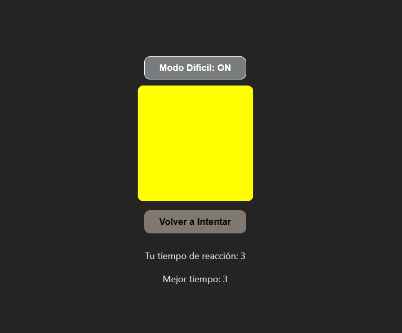

# 🟡 Juego de Reacción

Un juego simple de reacción creado con **React + Vite**. El objetivo es hacer clic en el cuadro amarillo lo más rápido posible para medir tu tiempo de reacción.

---

## 📸 Captura de pantalla



---

## 🚀 Funcionalidades

- ⏳ **Tiempo aleatorio:** El cuadro cambia a amarillo entre 3 y 7 segundos.
- 🖱️ **Clic de reacción:** El jugador debe hacer clic en el cuadro amarillo lo más rápido posible.
- 📊 **Registro de tiempos:** Se muestra el tiempo de reacción en milisegundos.
- 🏆 **Ranking:** Se guarda el mejor tiempo de reacción.
- 🔥 **Modo difícil:** En este modo, el cuadro amarillo solo aparece por menos de 1 segundo.

## 🛠️ Tecnologías utilizadas

- **React** (Hooks: useState, useEffect)
- **CSS** (para el diseño del juego)

## 📂 Instalación y ejecución

1. Clona este repositorio:
   ```bash
   git clone https://github.com/tu-usuario/nombre-del-repo.git
   ```
2. Entra en el directorio del proyecto:
   ```bash
   cd nombre-del-repo
   ```
3. Instala las dependencias:
   ```bash
   npm install
   ```
4. Inicia el servidor de desarrollo:
   ```bash
   npm start
   ```
   
---

Deployed: [https://cuyssi.github.io/juego-react/]

---

📫 Cómo contactarme

- Correo: Correo: [[anabcastrolopez@gmail.com](mailto:anabcastrolopez@gmail.com)]
- LinkedIn: [Ana] ([https://www.linkedin.com/in/ana-castro-a476b8346/](https://www.linkedin.com/in/ana-castro-a476b8346/))
- 
---

## 🌟 Any
Realizado con ❤️.

🚀 **Sigue explorando, sigue aprendiendo!**


¡Disfruta el juego y pon a prueba tu tiempo de reacción! 
